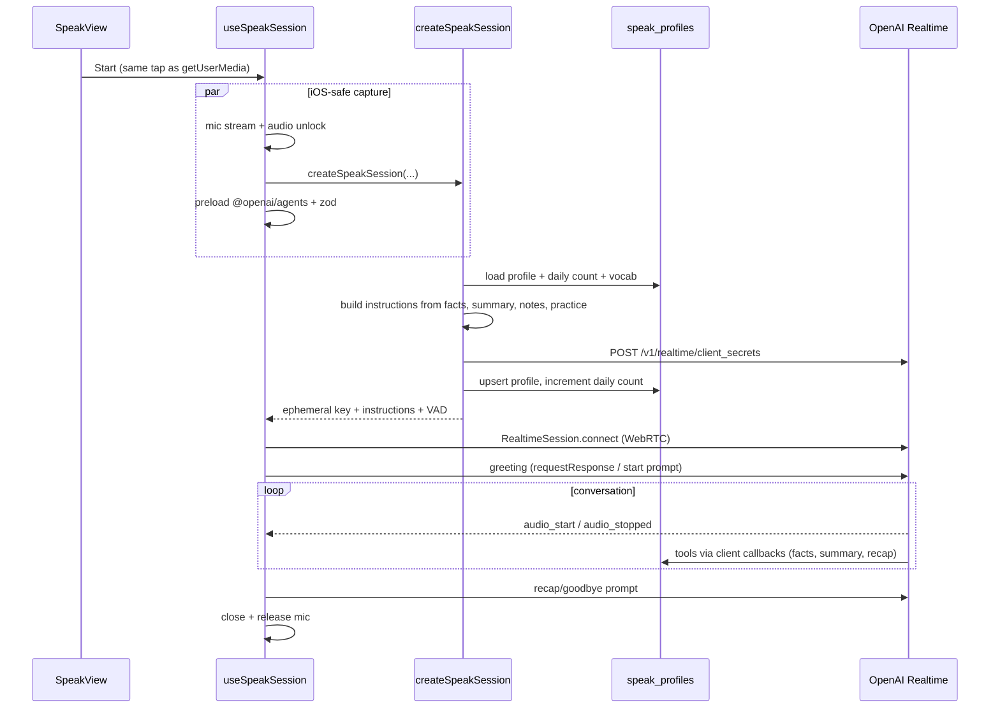

# Speak — Hebrew conversation practice

Living spec for the **Speak** feature: a real-time, audio-only Hebrew conversation with an AI teacher. This document is the canonical place to update as the feature evolves. High-level app wiring stays in [`architecture.md`](architecture.md); table/RLS details stay in [`database.md`](database.md).

**Product intent:** free conversation with a patient teacher, not a textbook unit. The learner never picks a topic. The teacher greets, chooses a fresh everyday opening from learner context, then follows the learner’s words. Praise, modeling, and correction are optional tools — not a per-turn recipe.

---

## Quick map

| Layer | Files |
|-------|--------|
| UI | [`src/components/SpeakView.tsx`](../src/components/SpeakView.tsx), [`src/app/styles/speak.css`](../src/app/styles/speak.css) |
| Session (WebRTC) | [`src/hooks/useSpeakSession.ts`](../src/hooks/useSpeakSession.ts) |
| Profile persistence | [`src/hooks/useSpeakProfile.ts`](../src/hooks/useSpeakProfile.ts) |
| Server mint + entitlements | `createSpeakSession` in [`src/app/actions.ts`](../src/app/actions.ts) |
| Teacher prompt | [`src/lib/speak/teacherPrompt.ts`](../src/lib/speak/teacherPrompt.ts) |
| Vocab / episode weaving | [`src/lib/speak/practiceContext.ts`](../src/lib/speak/practiceContext.ts) |
| Types + constants | [`src/lib/speak/types.ts`](../src/lib/speak/types.ts) |
| Sanitize / VAD / mapping | [`src/lib/speak/profileUtils.ts`](../src/lib/speak/profileUtils.ts) |
| Tests | `src/lib/speak/*.test.ts` (`npm test`) |
| Shell integration | [`src/components/AppShell.tsx`](../src/components/AppShell.tsx), [`src/components/Sidebar.tsx`](../src/components/Sidebar.tsx) |
| Copy (4 languages) | `speak*` keys in [`src/lib/i18n/messages.ts`](../src/lib/i18n/messages.ts) |
| Schema | migrations `13`, `14`, `15` under [`supabase/migrations/`](../supabase/migrations/) |

There is **no speak API route**. The browser calls the `createSpeakSession` server action, then connects WebRTC with an ephemeral OpenAI client secret.

---

## Learner experience

Fourth sidebar tab (`viewMode: "speak"`). Logged-out users see a login CTA. Authenticated users see setup, then a call screen.

### Setup (before Start)

| Control | Values | Persistence |
|---------|--------|-------------|
| Teacher voice | Female → Realtime voice `marin`; male → `cedar` | `speak_profiles.voice_gender` |
| Learner form of address | Female → `את`; male → `אתה` | `learner_facts.gender` |
| Hebrew level | `beginner` / `intermediate` / `advanced` | `speak_profiles.level` |
| Voice model | Quality `gpt-realtime-2.1` or cheaper `gpt-realtime-2.1-mini` | `speak_profiles.realtime_model` |
| Speaking speed | `0.25`–`1.5` (step `0.05`) | `speak_profiles.speech_speed` |

Speed defaults until the learner moves the slider: beginner `0.6`, intermediate `0.8`, advanced `1.0` (`SPEAK_SPEED_BY_LEVEL`). Changing level resets speed to that default unless the slider was already touched.

Known facts (name, gender, city, country, occupation, interests) are listed as read-only “Your teacher remembers” chips when present. There is no scene picker and no topic picker.

### In-call

Audio only — no captions, no transcript UI. Status orb: connecting / listening / speaking / thinking.

**Help chips** (disabled while connecting or while “I'm thinking” is on):

| Chip | What the teacher is told to do |
|------|--------------------------------|
| I don't understand | Simpler Hebrew, then a brief English gloss if needed |
| Slower | Repeat last turn slower and simpler; stay slower after |
| Shorter | One very short Hebrew sentence, then an open question only if it still fits |
| Give me a starter | One copyable Hebrew sentence on what you were just talking about |
| Skip topic | Leave this subject; ask one new open everyday question without announcing a unit |
| Let me talk more | One open prompt for 2–3 sentences, then wait in silence |
| Repeat after me | One short sentence, wait for echo, recast once, continue |
| I'm thinking | Client-side: interrupt + mute mic so VAD does not steal the pause |

There is **no automatic longer-turn timer**. Longer answers happen when the learner taps “Let me talk more” or when the teacher naturally waits.

Ending the call asks the teacher to save a recap + summary, waits 2.5s (`SPEAK_END_WAIT_MS`), then closes WebRTC.

The episode player pauses while a speak session is connecting or active (`pauseForSpeak` on `MediaPlayer`).

---

## Pedagogical contract

These rules live mainly in `buildTeacherInstructions`. Changing product behavior usually means changing this prompt *and* the matching help-prompt builders, not only the UI.

The prompt follows OpenAI Realtime voice guidance: explicit personality and tone, short spoken turns, a variety constraint, unclear-audio handling, and no stock reaction phrases.

**Do**

- Speak first; never wait silently for the learner.
- Greet by name if known. Memory is optional context, not a compulsory callback or quiz.
- Choose one fresh everyday opening from interests, unused previous-summary detail, practice material only if it truly fits, or ordinary life. Ask one open question (`מה` / `איך` / `ספר`).
- After they speak: follow their last words. Acknowledge something specific, recast at most one clear mistake, ask one open follow-up, or offer a tiny bit of useful Hebrew — not all of these every turn.
- Follow the learner if they change subject on the next turn.
- Light correction only. If it was understandable, do not correct.
- Unknown words: simpler Hebrew first, then a few words of English, then back to Hebrew.
- Vary wording. Most turns need no praise. If you praise, name the specific word or sentence.

**Do not**

- Roleplay café waiter, street directions, fake phone call, or recited daily routine (scenes were removed in migration 15).
- Invent personal memories, meals, weather, city, plans, pets, or friends. Example sentences are language, not biography.
- Re-interview known facts (name, city, job, gender).
- Fire two questions in one turn.
- Require a question, a model sentence, or praise on every turn.
- Reopen the previous session’s main topic as today’s opener.
- Speak English except as a last-resort gloss.
- Output stage directions or meta commentary.
- Store full transcripts.
- Redirect the talk to force vocabulary or episode words.

**By level**

| Level | Teacher turns | Learner target | Scaffolding |
|-------|---------------|----------------|-------------|
| Beginner (A1) | One short sentence, often one open question, then wait | A short sentence, not one word | Model a sentence only if they freeze or ask for help. Stay silent while they think. |
| Intermediate (B1) | 1–2 sentences | A sentence or two | Recast lightly, then continue their story. |
| Advanced (B2+) | 1–3 short sentences | A few sentences | Opinions or a short story when they go there. |

**Time budget** (injected into the prompt):

- Free (~3 min): stay with the talk; last ~20 seconds is goodbye only.
- Premium: untimed; still follow the learner rather than rushing subjects.

---

## Session lifecycle

### Client start (`useSpeakSession`)

1. Guard: must have `accessToken`, not already active, not already starting.
2. **Same user-gesture tap:** create a hidden `<audio>` element, unlock Web Audio (iOS Safari), `getUserMedia` with echo cancellation + noise suppression. Keep that stream alive — stopping it and requesting again after the server round-trip fails on iOS.
3. In parallel: `createSpeakSession`, dynamic `import("@openai/agents/realtime")`, `import("zod")`.
4. On success, build a `RealtimeAgent` named `HebrewTeacher` with three tools, wrap in `RealtimeSession` + `OpenAIRealtimeWebRTC`.
5. Config: `outputModalities: ["audio"]`, `reasoning.effort: "low"`, near-field noise reduction, semantic VAD, output voice + speed from the server.
6. Connect with the ephemeral `clientSecret` (the OpenAI API key never reaches the browser).
7. Trigger greeting if audio has not already started (`transport.requestResponse()`, else `sendMessage(buildStartSessionPrompt())`).
8. Beginners: mute the mic while the teacher is speaking (no barge-in). Failsafe unmute after 4s if greeting audio never started.
9. For free users, start the countdown.

Recoverable Realtime errors (overlapping `response.create`, cancel-when-idle, empty commit, barge-in truncation) are ignored so a mid-call glitch does not tear down the session.

### Server mint (`createSpeakSession`)

Order of checks:

1. Validate `voiceGender`, `level`, `realtimeModel`.
2. Auth from access token.
3. In-memory rate limit: 10 starts / 60s / user (`actionGuards`).
4. Premium/admin vs free.
5. Load `speak_profiles`, today's `speak_sessions_count`, and practice block (vocab + episode snippet) in parallel.
6. Free users with `speak_sessions_count >= 1` → `{ type: "limit_reached" }` (upsell).
7. Merge optional `learnerGender` from the setup toggle into stored facts.
8. `buildTeacherInstructions(...)` from level, facts, previous summary, session notes, practice block, and time budget. No spark catalog.
9. `POST https://api.openai.com/v1/realtime/client_secrets` with `OpenAI-Safety-Identifier: sha256(user_id)`.
10. Upsert profile (preferences + facts + notes). Free users reserve `speak_sessions_count` atomically **before the upstream mint**, on the same request, so concurrent starts cannot overrun the cap. A confirmed upstream failure releases the reservation; a successful mint consumes it even if WebRTC later fails to connect.

Return shape (`CreateSpeakSessionResult`): `success` | `auth_required` | `limit_reached` | `error`.

---

## Practice context

Built server-side in `loadSpeakPracticeBlock` → `formatPracticeContextBlock`, appended to the teacher prompt as `# Practice material` when present.

**Due vocabulary** (`pickSpeakTargetWords`, max 8):

- Latest 40 vocab rows + forward-direction `flashcard_progress`.
- A word is “due” if there is no progress row, or it is not learned and `next_review_at` is null or in the past.
- Due words first (still newest-saved first within each bucket), then the rest. Deduped by `word`.

**Current episode** (from `AppShell`: episode title + first 600 chars of `hebrew_text`):

- Title (clamped, wrapped as user content).
- Up to 5 distinct Hebrew tokens (`extractHebrewTokens`).

Teacher may use **at most one** vocab or episode word if it already fits what the learner is saying. Otherwise ignore the list. Never redirect the conversation to force practice material. If both vocab and episode are empty, the practice section is omitted.

---

## Teacher memory (not a chat log)

One `speak_profiles` row per user. **No transcripts are stored.**

| Column | Contents |
|--------|----------|
| `voice_gender` | `male` / `female` |
| `level` | `beginner` / `intermediate` / `advanced` |
| `realtime_model` | `gpt-realtime-2.1` / `gpt-realtime-2.1-mini` |
| `speech_speed` | `0.25`–`1.5` |
| `learner_facts` | JSONB: `name`, `gender` (`male`/`female`), `city`, `country`, `occupation`, `interests` (strings max 120 chars) |
| `conversation_summary` | English, max 500 chars, 1–2 sentences of **subjects actually discussed** last call |
| `session_notes` | JSONB (see below) |

`session_notes` shape (camelCase in TS, snake_case in the row):

| Key | Max | Written when |
|-----|-----|----------------|
| `last_corrections` | 5 × 120 chars | Recap tool `recast` |
| `target_phrases` | 5 × 120 chars | Recap tool Hebrew phrases |

Sanitization accepts both camelCase and snake_case on read. `mergeSessionNotes` prepends new corrections/phrases onto existing lists. Legacy `recent_topics` keys (old spark ids) are ignored on read and dropped on the next notes write. No migration is required.

`conversation_summary` is the cross-session continuity mechanism. The recap tool is told to summarize actual subjects so the next call does not reopen the same opener.

RLS: authenticated users CRUD their own row only. Daily caps are **not** in RLS; they are enforced in `createSpeakSession` via the migration 16 `reserve_daily_usage()` RPC (service role only), with confirmed upstream failures releasing the reservation.

Schema history: migration 13 created the table; 14 added `scene` + `session_notes`; 15 dropped `scene`. Do not reintroduce a scene column or a spark catalog without a new product decision.

---

## Realtime tools

Registered on the client `RealtimeAgent`. Executes are fire-and-forget (`void` the save) so they do not block the next audio turn. The prompt forbids calling tools on the opening greeting.

| Tool | Payload | Side effect |
|------|---------|-------------|
| `save_learner_facts` | Optional name, gender, city, country, occupation, interests | Merge into `learner_facts` (client upsert via RLS) |
| `update_conversation_summary` | English string ≤500 | Replace `conversation_summary` |
| `save_session_recap` | Up to 3 `{hebrew, english}` phrases; optional recast; optional new word | Merge into `session_notes`; save phrases + new word to **vocabulary** as `entry_kind: "phrase"` with episode title “Speak Hebrew” |

---

## Turn detection and barge-in

`getSpeakTurnDetection(level)`:

| Level | `semantic_vad` eagerness | `interruptResponse` (barge-in) |
|-------|--------------------------|--------------------------------|
| Beginner | `low` | `false` (mic muted while teacher speaks) |
| Intermediate | `low` | `true` |
| Advanced | `medium` | `true` |

Low eagerness is intentional: thinking pauses should not cut a longer answer. The same settings are sent both in the client-secret mint (`toClientSecretTurnDetection`) and in the browser session config (`toRealtimeTurnDetection`).

Help chips that inject a prompt while the teacher is talking interrupt first, then `sendMessage` after 120ms, so overlapping `response.create` is less likely.

---

## Entitlements and timing

| User | Speak access |
|------|----------------|
| Logged out | Login CTA |
| Free authenticated | 1 session / UTC day, hard stop at 180s |
| Premium / admin | Unlimited, no countdown |

Constants in `types.ts`:

| Constant | Value | Meaning |
|----------|-------|---------|
| `FREE_SPEAK_SESSION_LIMIT_SECONDS` | 180 | Full free call including goodbye |
| `SPEAK_RECAP_WINDOW_SECONDS` | 20 | At T−20s, inject `buildRecapSoonPrompt`; no new subject |
| `SPEAK_END_WAIT_MS` | 2500 | Wait after end-call recap prompt before `close()` |

Free countdown UI uses the 180s total.

Daily count lives on `user_activity_daily.speak_sessions_count`. Hitting the cap shows the subscription upsell (`speak_limit` source: “Daily speak session used”).

---

## Security

- OpenAI API key stays on the server. Browser receives only a short-lived Realtime client secret.
- `OpenAI-Safety-Identifier` is `SHA-256(user_id)`, not the raw id.
- `Permissions-Policy: microphone=(self)` in [`next.config.ts`](../next.config.ts).
- CSP `connect-src` includes `https://api.openai.com` and `https://*.openai.com` (WebRTC / Realtime).
- `createSpeakSession` rate limited (10 / minute / user), in-process (resets on server restart; not a distributed limit); the limiter prunes expired entries and caps new keys.
- Profile writes from the browser use the user's JWT + RLS. The daily counter RPC is service-role only so clients cannot increment (or reset) their own cap.

---

## i18n and chrome

All user-visible Speak strings are `speak*` keys in `messages.ts` (en, ru, es, fr). Adding a chip or setup control requires all four supported catalogs. Retired Portuguese/Ukrainian keys may remain in old production JSON rows, but runtime language selection excludes them.

`AppShell` mounts `SpeakView` even when the tab is hidden (`hidden={viewMode !== "speak"}`) so profile load can happen in the background. Recap phrases call `addWord` as phrases.

Sidebar speak panel is informational only (audio-only badge + free-tier badge + hint). All controls are in the main panel.

---

## How to change things

Use this as a checklist when iterating. Prefer updating this doc in the same change.

### Change teacher behavior (pacing, correction, opening, naturalness)

- Session-wide policy → `buildTeacherInstructions` in `teacherPrompt.ts`.
- One-shot in-call behavior → the `build*Prompt` helpers, wired in `useSpeakSession`.
- Level-specific VAD / barge-in → `getSpeakTurnDetection` (and re-test beginners especially).
- Prompt string contracts → `src/lib/speak/*.test.ts`. Keep asserting: no spark/ladder/stock-praise language; variety + unclear-audio + no-invent rules stay present.

### Change setup UI or help chips

- `SpeakView.tsx` + `speak.css`.
- New copy: `messages.ts` (four supported languages: English, Russian, Spanish, French).
- New in-call action: add a `build*Prompt`, expose it from `useSpeakSession`, wire the button.

### Change memory shape

- Types in `types.ts`.
- Sanitize / merge / `sessionNotesToRow` in `profileUtils.ts`.
- Tool schemas in `useSpeakSession.ts`.
- Prompt sections that print facts/notes.
- New column → new numbered migration (do not edit 13–15). Update [`database.md`](database.md).

### Change free-tier limits

- Duration: `FREE_SPEAK_SESSION_LIMIT_SECONDS` / `SPEAK_RECAP_WINDOW_SECONDS`.
- Sessions per day: the `sessionsToday >= 1` check in `createSpeakSession` (RPC already increments by 1).
- Upsell copy: `speakLimitTitle` / `speakLimitDesc`.

### Change models or voices

- Allowed models: `SpeakRealtimeModel` + DB check constraint (new migration if you add a model id).
- Voices: `SPEAK_VOICE_BY_GENDER` (`marin` / `cedar`). Setup UI is gender, not voice id.

---

## Known constraints (useful before a big improvement)

- **Audio only.** No ASR captions in the UI; Realtime output modality is audio. Adding captions is a product + SDK change, not a CSS tweak.
- **No session history UI.** Memory is facts + a 500-char summary + tiny notes. Replaying a call is impossible by design today.
- **Quota on mint, not on connect.** A successful client-secret mint consumes the free daily session even if WebRTC fails afterward.
- **In-memory rate limit.** `createSpeakSession` throttling is per Node process.
- **Client duration enforcement.** The three-minute timer is enforced in the browser; authoritative call termination needs separate infrastructure.
- **iOS Safari** requires mic + audio unlock in the originating tap; do not move `getUserMedia` to after the server round-trip.
- **Episode context is whatever episode is selected**, even if the user is on the Speak tab — it is an optional hint, not a lesson plan.
- **No spark catalog.** Topic variety comes from the teacher prompt + `conversation_summary`, not a pooled script.
- **Tests cover prompt and notes contracts**, not live Realtime audio. Use the rubric below after prompt changes.

---

## Manual voice-evaluation rubric

After changing the teacher prompt, run at least one call at beginner, intermediate, and advanced. Fail the change if any item is consistently false.

| Check | Passes when |
|-------|-------------|
| Opening variety | Greeting is short; the first question is an open everyday question, not a recitation or last-session replay |
| No habitual praise | Most turns have no empty “nice / well done / wow”; any praise names something specific |
| Content-specific follow-ups | Next question uses a word or detail the learner just said |
| Learner-led topic change | If they change subject, the teacher follows within one turn |
| Natural skip | Skip topic changes subject without announcing a new unit |
| Honest teacher persona | No invented meals, weather, city, plans, or “also me” biography |
| Sparse correction | Understandable speech is left alone; at most one recast per turn |
| Thinking pauses | After a question, the teacher waits; “I'm thinking” is not talked over |
| Unclear audio | Noise or a missed word gets a brief “say that again”, not filler chatter |

---

## Related docs

- [`architecture.md`](architecture.md) — app overview, premium table, security notes
- [`database.md`](database.md) — `speak_profiles`, migrations 13–16, and atomic usage reservations
- [`dictionary_entries.md`](dictionary_entries.md) — not used during a call; vocab saves from recap are user-typed phrases, not Pealim lookups
