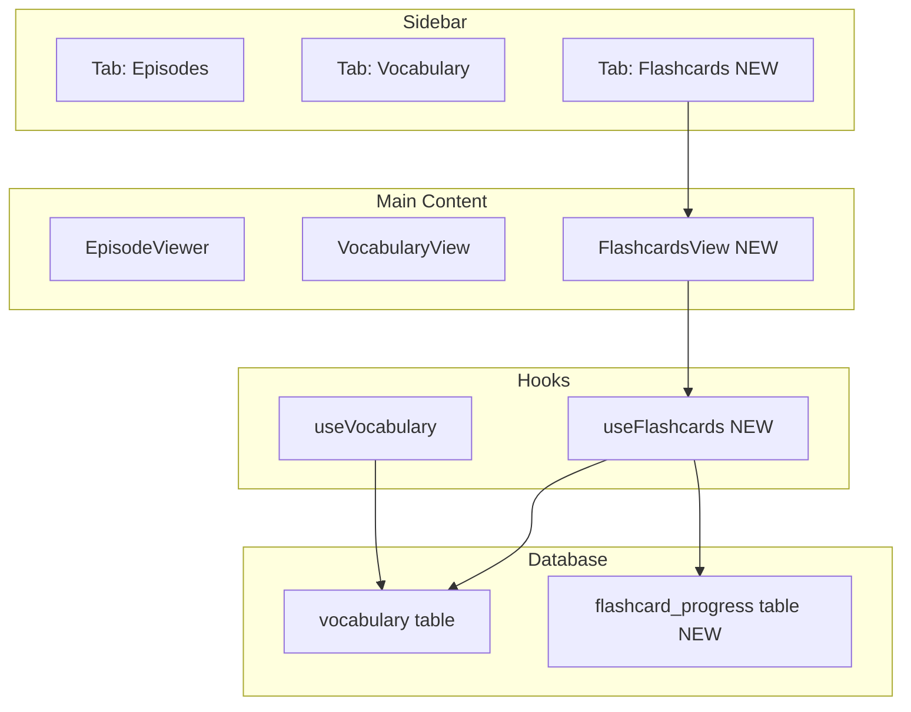

# Flashcard System — Implementation Plan

A spaced-repetition flashcard tab that lets users test their knowledge of saved Hebrew vocabulary words and automatically tracks which words they've mastered.

## User Review Required

> [!IMPORTANT]
> **Premium gating**: The flashcard tab will follow the same premium-gating pattern as the Vocabulary tab — non-premium users who click the tab see the `$10/month` subscription prompt. Confirm this is desired behavior.

> [!IMPORTANT]
> **Algorithm choice**: The plan uses the **SM-2 spaced-repetition algorithm** (the same algorithm behind Anki). Words are scheduled at increasing intervals as the user rates their confidence. After a word reaches **interval ≥ 21 days** (3 weeks), it is marked as "Learned" and excluded from future review sessions. The user can view and un-learn words from a "Learned Words" section. Does this threshold feel right, or would you prefer a different graduation point?

> [!WARNING]
> **No new npm dependencies** are introduced. The SM-2 algorithm is implemented in pure TypeScript (~40 lines). The flip-card animation uses vanilla CSS 3D transforms.

## Open Questions

1. **Session size**: The default review session pulls up to **20 cards** (due + new). Would you prefer a different limit?
2. **Self-grading scale**: The plan uses 4 buttons: **Again** (forgot), **Hard**, **Good**, **Easy**. Would you prefer a simpler binary (Know it / Don't know it)?
3. **Learned threshold**: Words with an interval ≥ 21 days graduate to "Learned". Should this be configurable per user, or is a fixed threshold fine?

---

## Architecture Overview



---

## Proposed Changes

### Supabase Database Schema

#### [NEW] `flashcard_progress` table

Tracks per-word spaced-repetition state for each user. Words from the `vocabulary` table that do **not** have a row here are treated as "new" (never reviewed).

```sql
CREATE TABLE IF NOT EXISTS public.flashcard_progress (
  id UUID PRIMARY KEY DEFAULT gen_random_uuid(),
  user_id UUID REFERENCES auth.users(id) ON DELETE CASCADE NOT NULL,
  vocab_id UUID REFERENCES public.vocabulary(id) ON DELETE CASCADE NOT NULL,
  ease_factor REAL NOT NULL DEFAULT 2.5,        -- SM-2 ease factor (>= 1.3)
  interval_days INTEGER NOT NULL DEFAULT 0,     -- current interval in days
  repetitions INTEGER NOT NULL DEFAULT 0,       -- consecutive correct answers
  next_review_at TIMESTAMPTZ NOT NULL DEFAULT NOW(), -- when the card is next due
  is_learned BOOLEAN NOT NULL DEFAULT FALSE,    -- graduated (interval >= 21 days)
  last_reviewed_at TIMESTAMPTZ,
  created_at TIMESTAMPTZ NOT NULL DEFAULT NOW(),
  UNIQUE(user_id, vocab_id)
);

ALTER TABLE public.flashcard_progress ENABLE ROW LEVEL SECURITY;

CREATE POLICY "Users view own flashcard progress"
  ON public.flashcard_progress FOR SELECT USING (auth.uid() = user_id);
CREATE POLICY "Users insert own flashcard progress"
  ON public.flashcard_progress FOR INSERT WITH CHECK (auth.uid() = user_id);
CREATE POLICY "Users update own flashcard progress"
  ON public.flashcard_progress FOR UPDATE USING (auth.uid() = user_id);
CREATE POLICY "Users delete own flashcard progress"
  ON public.flashcard_progress FOR DELETE USING (auth.uid() = user_id);
```

> [!NOTE]
> An `UPDATE` policy is needed here (unlike the vocabulary table which only has SELECT/INSERT/DELETE) because the SM-2 algorithm updates `ease_factor`, `interval_days`, `repetitions`, and `next_review_at` after each review.

---

### Types

#### [MODIFY] [types.ts](file:///Users/felipemediavillalevinson/Documents/Hebreo/hebrewtime/src/lib/types.ts)

Add the flashcard progress type and extend the view mode union:

```typescript
// SM-2 quality ratings (0-5 scale mapped to 4 buttons)
export type FlashcardRating = 0 | 1 | 3 | 5; // Again=0, Hard=1, Good=3, Easy=5

export type FlashcardProgress = {
  id: string;
  vocabId: string;
  easeFactor: number;
  intervalDays: number;
  repetitions: number;
  nextReviewAt: string;       // ISO timestamp
  isLearned: boolean;
  lastReviewedAt: string | null;
};

// A card ready for review — vocabulary word + its progress state
export type FlashcardItem = VocabWord & {
  progress: FlashcardProgress | null; // null = new card (never reviewed)
};
```

---

### SM-2 Algorithm

#### [NEW] [sm2.ts](file:///Users/felipemediavillalevinson/Documents/Hebreo/hebrewtime/src/lib/sm2.ts)

Pure-TypeScript implementation of the SM-2 spaced-repetition algorithm (~40 lines, zero dependencies):

```typescript
/**
 * SM-2 Spaced Repetition Algorithm
 * 
 * Given the current card state and a quality rating (0-5),
 * returns the updated state (new ease factor, interval, repetitions, next review date).
 * 
 * Quality mapping:
 *   0 = Again (complete blackout)
 *   1 = Hard  (significant difficulty)
 *   3 = Good  (correct with effort)
 *   5 = Easy  (effortless recall)
 *
 * Graduation: when interval_days >= LEARNED_THRESHOLD, is_learned = true
 */

const LEARNED_THRESHOLD = 21; // days

export function sm2(
  quality: 0 | 1 | 3 | 5,
  prevEase: number,
  prevInterval: number,
  prevReps: number
): { easeFactor: number; intervalDays: number; repetitions: number;
     nextReviewAt: string; isLearned: boolean }
```

---

### Custom Hook

#### [NEW] [useFlashcards.ts](file:///Users/felipemediavillalevinson/Documents/Hebreo/hebrewtime/src/hooks/useFlashcards.ts)

Manages loading flashcard data, building the review queue, and persisting progress to Supabase.

**Responsibilities:**
1. Load all `flashcard_progress` rows for the user on mount.
2. Join with `vocabWords` (passed from `useVocabulary`) to build `FlashcardItem[]`.
3. Build a **review queue**: cards where `next_review_at <= now` (due) + new cards (no progress row), capped at session size (default 20).
4. Expose `submitReview(vocabId, rating)` — runs SM-2, upserts to Supabase, updates local state.
5. Expose `unlearnWord(vocabId)` — resets progress so the card re-enters the review pool.
6. Expose computed stats: `{ totalCards, dueCount, newCount, learnedCount }`.

```typescript
type FlashcardStats = {
  totalCards: number;
  dueCount: number;
  newCount: number;
  learnedCount: number;
};
```

**Key design decisions:**
- Uses the existing `vocabWords` array from `useVocabulary` as the source of truth for the word content — no duplication.
- Progress rows are fetched independently and merged client-side.
- Optimistic UI: local state is updated immediately; Supabase upsert happens in the background.

---

### Components

#### [NEW] [FlashcardsView.tsx](file:///Users/felipemediavillalevinson/Documents/Hebreo/hebrewtime/src/components/FlashcardsView.tsx)

The main flashcard review UI rendered in the main content area. Follows the same page-level layout pattern as `VocabularyView.tsx`.

**UI Structure:**

```
+--------------------------------------------+
|  Flashcards                       12 due   |  <- Page header (same style as Vocabulary)
|  Test your Hebrew vocabulary               |
+--------------------------------------------+
|                                            |
|       +----------------------------+       |
|       |                            |       |
|       |      Hebrew word           |       |  <- Front: Hebrew word (large, serif)
|       |                            |       |
|       |      tap to reveal         |       |
|       |                            |       |
|       +----------------------------+       |
|                                            |
|    [Again]  [Hard]  [Good]  [Easy]         |  <- Rating buttons (shown after flip)
|                                            |
|    -- Progress ----------------------      |
|    ||||||||....  8/20 cards                |  <- Session progress bar
|                                            |
+--------------------------------------------+
|  Learned Words (42)                        |  <- Collapsible section
|  +-------------------------------------+  |
|  | Hebrew  translation    [Review]     |  |
|  | Hebrew  translation    [Review]     |  |
|  +-------------------------------------+  |
+--------------------------------------------+
```

**Card flip animation** (CSS 3D transform):
- Card has front (Hebrew word) and back (translation + pronunciation + verb form + source episode).
- Click/tap flips the card with a smooth `rotateY(180deg)` transition.
- After flipping, the 4 rating buttons appear below the card with a fade-in animation.

**States:**
1. **Review session active**: Shows current card, progress bar, rating buttons.
2. **Session complete**: Congratulatory message with stats ("You reviewed 20 cards! 15 correct, 5 to retry.") and a "Review Again" button if there are still due cards.
3. **No cards available**: Empty state — "All caught up! Come back later or add more words from episodes."
4. **Empty vocabulary**: Same empty state pattern as VocabularyView — "No words saved yet."

**Learned Words section:**
- Collapsible list below the flashcard area.
- Each row shows: Hebrew word, translation, and a "Review Again" button that calls `unlearnWord()`.
- Styled consistently with the vocabulary table design.

---

### Sidebar Integration

#### [MODIFY] [Sidebar.tsx](file:///Users/felipemediavillalevinson/Documents/Hebreo/hebrewtime/src/components/Sidebar.tsx)

- Expand `viewMode` type from `"episodes" | "vocabulary"` to `"episodes" | "vocabulary" | "flashcards"`.
- Add a third tab button "Flashcards" with a `Brain` icon (from `lucide-react`) next to the existing Episodes and Vocabulary tabs.
- When in flashcards mode, the sidebar body shows a summary: "X cards due today - Y learned".
- Flashcards tab follows the same premium-gating tooltip pattern as Vocabulary.

---

### AppShell Integration

#### [MODIFY] [AppShell.tsx](file:///Users/felipemediavillalevinson/Documents/Hebreo/hebrewtime/src/components/AppShell.tsx)

- Expand `viewMode` state type to include `"flashcards"`.
- Import and render `FlashcardsView` when `effectiveViewMode === "flashcards"`.
- Instantiate `useFlashcards(vocabWords)` hook.
- Pass flashcard stats (`dueCount`) to `Sidebar` for the badge.
- Apply the same premium gating logic used for vocabulary: non-premium users clicking the flashcards tab triggers `showSubscriptionPrompt`.
- Extend `scrollPositions` record to include `flashcards` key.

---

### Styling

#### [MODIFY] [globals.css](file:///Users/felipemediavillalevinson/Documents/Hebreo/hebrewtime/src/app/globals.css)

New CSS sections (appended, following the existing naming conventions):

**Flashcard page layout** — same padding/max-width as `.vocab-page-header` and `.vocab-table-wrap`.

**Flip card styles:**
```css
.flashcard-scene {
  perspective: 1000px;
}
.flashcard-card {
  transition: transform 0.5s cubic-bezier(0.4, 0, 0.2, 1);
  transform-style: preserve-3d;
}
.flashcard-card.flipped {
  transform: rotateY(180deg);
}
.flashcard-front, .flashcard-back {
  backface-visibility: hidden;
}
.flashcard-back {
  transform: rotateY(180deg);
}
```

**Rating buttons:** 4 buttons with distinct colors following the existing design language:
- Again: soft red (`#ff4444` tones)
- Hard: soft orange (`#f59e0b` tones)  
- Good: accent blue (`var(--accent)`)
- Easy: soft green (`#10b981` tones — same as the finished episode checkmark)

**Progress bar:** thin animated bar using the same border-radius and transition patterns as existing UI elements.

**Learned words section:** reuses `.vocab-table` styling patterns (same border, border-radius, hover states).

**Responsive:** Card scales down on mobile, rating buttons stack 2x2 on small screens.

---

## File Summary

| File | Action | Description |
|------|--------|-------------|
| [types.ts](file:///Users/felipemediavillalevinson/Documents/Hebreo/hebrewtime/src/lib/types.ts) | MODIFY | Add `FlashcardRating`, `FlashcardProgress`, `FlashcardItem` types |
| [sm2.ts](file:///Users/felipemediavillalevinson/Documents/Hebreo/hebrewtime/src/lib/sm2.ts) | NEW | SM-2 algorithm implementation (~50 lines) |
| [useFlashcards.ts](file:///Users/felipemediavillalevinson/Documents/Hebreo/hebrewtime/src/hooks/useFlashcards.ts) | NEW | Hook: load progress, build queue, submit reviews, unlearn |
| [FlashcardsView.tsx](file:///Users/felipemediavillalevinson/Documents/Hebreo/hebrewtime/src/components/FlashcardsView.tsx) | NEW | Main flashcard UI component |
| [Sidebar.tsx](file:///Users/felipemediavillalevinson/Documents/Hebreo/hebrewtime/src/components/Sidebar.tsx) | MODIFY | Add third "Flashcards" tab with Brain icon |
| [AppShell.tsx](file:///Users/felipemediavillalevinson/Documents/Hebreo/hebrewtime/src/components/AppShell.tsx) | MODIFY | Wire flashcards view mode, hook, and premium gating |
| [globals.css](file:///Users/felipemediavillalevinson/Documents/Hebreo/hebrewtime/src/app/globals.css) | MODIFY | Flashcard-specific styles (flip animation, rating buttons, progress bar, learned section) |
| Supabase SQL | MANUAL | Create `flashcard_progress` table (run once in SQL Editor) |

---

## Verification Plan

### Automated Tests
1. **TypeScript build**: `npm run build` — ensure no type errors from the new types and components.
2. **Lint**: `npm run lint` — verify no ESLint issues.

### Manual Verification
1. **Tab switching**: Click Episodes -> Vocabulary -> Flashcards and confirm scroll position is preserved.
2. **Premium gating**: Log out -> click Flashcards tab -> verify subscription prompt appears.
3. **Empty state**: Premium user with 0 vocabulary words -> verify empty state message.
4. **Card review flow**: 
   - Save 3+ words via word-click in an episode.
   - Navigate to Flashcards tab.
   - Verify cards appear, flip animation works, rating buttons appear after flip.
   - Rate each card and verify progress bar advances.
5. **Session completion**: Complete all cards -> verify congratulatory screen.
6. **Persistence**: Rate cards -> refresh page -> verify progress is persisted (due dates updated in Supabase).
7. **Learned words**: Rate a word as "Easy" multiple times until it graduates -> verify it appears in the Learned section -> click "Review Again" -> verify it re-enters the queue.
8. **Mobile**: Test on iPhone Safari — verify card fits screen, rating buttons are tappable, learned section scrolls correctly.
